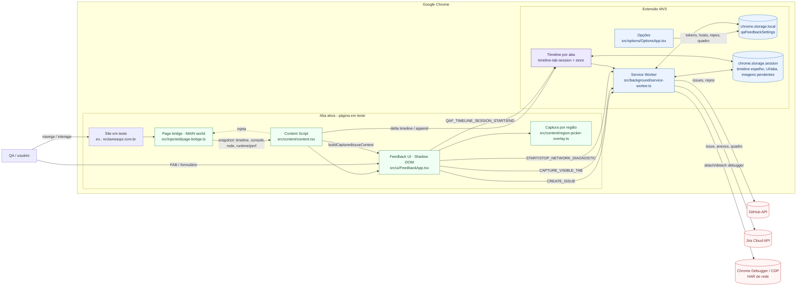

# Arquitetura — visão geral (QAFeedback)

**Idioma:** português do Brasil (pt-BR).

> Objetivo: mapa da extensão Chrome MV3 — camadas no browser, fluxos principais e integrações externas.

**Ver também:** [extension/DOCUMENTATION.md](extension/DOCUMENTATION.md) (detalhe técnico), [prd/LINGUAGEM-UBIQUA.md](prd/LINGUAGEM-UBIQUA.md) (vocabulário), [PRD-010 — linha do tempo contínua](prd/PRD-010-linha-tempo-continua/prd.md) (sessão por aba no SW).

---

## 1) Diagrama (renderização estática)

Para visualização em qualquer viewer (PDF, revisão offline, GitHub, preview do Cursor/VS Code, ferramentas sem suporte a Mermaid):

<!-- No GitHub, `` relativo costuma ser bloqueado pelo sanitizador (imagem quebrada / ponto vermelho). Use sempre `` em Markdown. -->

*Arquivo gerado a partir do diagrama Mermaid abaixo; ao alterar o desenho, regenere o PNG se quiser manter paridade.*

---

## 2) Diagrama fonte (Mermaid)

---

## 3) Fluxo ponta a ponta (resumo)

1. O QA navega no site e abre o painel (**FAB**).
2. O **page bridge** (MAIN world) observa timeline, rede, console, runtime e performance.
3. O **content script** consolida snapshot técnico; envia **incrementos de timeline** ao SW (`QAF_TIMELINE_APPEND`) para manter histórico na **mesma aba** após trocas de URL ([PRD-010](prd/PRD-010-linha-tempo-continua/prd.md)).
4. No envio, a UI pede timeline consolidada (`QAF_TIMELINE_GET_FOR_SUBMIT`), monta o payload e envia **`CREATE_ISSUE`** ao SW.
5. O SW usa `chrome.storage.local`, chama **GitHub** e/ou **Jira**, e opcionalmente **screenshot** do viewport e **HAR** (CDP) para o Jira.

---

## 4) Mapa de responsabilidades

### Na aba (conteúdo)

| Peça | Papel |
|------|--------|
| `content.tsx` | Bootstrap na página, host Shadow DOM. |
| `FeedbackApp.tsx` | Formulário, preview, envio, anexos, sessão de timeline (START/END). |
| `page-bridge.ts` | Telemetria no contexto real da página (MAIN world). |
| `context-collector.ts` | Consolida contexto para a issue; append de timeline ao SW. |
| `region-picker-overlay.ts` | Fluxo de captura por região no viewport. |

### Núcleo MV3

| Peça | Papel |
|------|--------|
| `service-worker.ts` | Mensagens, GitHub/Jira, CDP para HAR. |
| `timeline-tab-session.ts` + `timeline-session-store.ts` | Sessão de timeline por `tabId`, dedupe, TTL, espelho em `session` storage. |
| `network-debugger-capture.ts` | Rede via CDP para arquivo HAR. |
| `storage.ts` | Preferências e tokens em `local`. |

### Integrações

- **GitHub** — issues e listagem de repositórios.
- **Jira Cloud** — criação de issue, quadro, anexos (imagens, HAR).
- **CDP** — captura diagnóstica de tráfego na aba ativa.

---

## 5) Evoluções opcionais do desenho

- Diagrama de **sequência** (abrir painel → coletar contexto → criar issue).
- Detalhar só **timeline contínua** (watermark, fila de append, rehydrate após restart do SW).
- Regenerar **`prd/assets/mermaid.png`** após editar o bloco Mermaid (export no Mermaid Live Editor, CLI `mmdc`, ou script de CI).
